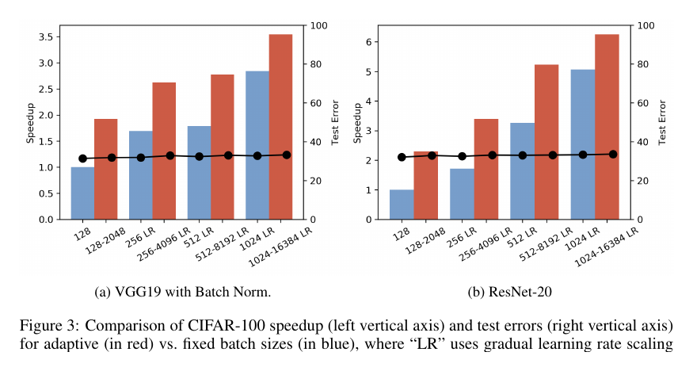

##### Download

+ [Paper](https://arxiv.org/abs/1712.02029)

---

##### Abstract

Training deep neural networks with stochastic gradient descent, or its variants, requires careful choice of both learning rate and batch size. While smaller batch sizes generally converge in fewer training epochs, larger batch sizes offer more parallelism and better computational efficiency. We developed a training approach that adaptively increases the batch size during the training process rather than statically choosing a single batch size for all epochs. The method delivers the convergence rate of small batch sizes while achieving performance similar to large batch sizes. We analyze the approach using AlexNet, ResNet, and VGG on CIFAR-10, CIFAR-100, and ImageNet. The results demonstrate that learning with adaptive batch sizes can improve performance by factors up to 6.25x on 4 NVIDIA Tesla P100 GPUs while changing accuracy by less than 1% relative to training with fixed batch sizes.

---

##### Figure 3: Adaptive Batch-Size Speedup and Test Error



---

##### Citation

Aditya Devarakonda, Maxim Naumov and Michael Garland, "AdaBatch: Adaptive Batch Sizes for Training Deep Neural Networks", *arXiv:1712.02029*, 2017. https://arxiv.org/abs/1712.02029

```latex
@misc{devarakonda2017adabatch,
  title={AdaBatch: Adaptive Batch Sizes for Training Deep Neural Networks},
  author={Devarakonda, Aditya and Naumov, Maxim and Garland, Michael},
  year={2017},
  eprint={1712.02029},
  archivePrefix={arXiv},
  primaryClass={cs.LG},
  url={https://arxiv.org/abs/1712.02029}
}
```

---
