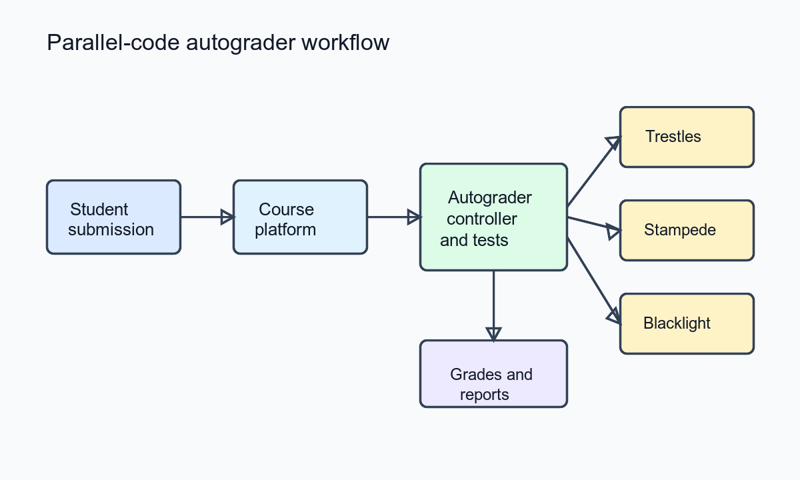

##### Download

+ [Paper](https://doi.org/10.1145/2616498.2616571)

---

##### Abstract

As parallel computing grows and becomes an essential part of computer science, tools must be developed to help grade assignments for large courses, especially with the prevalence of massive open online courses increasing in recent years. This paper describes general challenges related to building an autograder for parallel code and gives sample design decisions covering the assignments presented. The paper explores the results and experiences from using these autograders to enable the XSEDE 2013 and 2014 Parallel Computing Course using resources from SDSC Trestles, TACC Stampede, and PSC Blacklight.

---

##### Overview: Parallel-Code Autograding Workflow



---

##### Citation

Razvan Carbunescu, Aditya Devarakonda, James Demmel, Steven Gordon, Jay Alameda and Susan Mehringer, "Architecting an Autograder for Parallel Code", *Proceedings of the 2014 Annual Conference on Extreme Science and Engineering Discovery Environment*, pp. 1-8, 2014. https://doi.org/10.1145/2616498.2616571

```latex
@inproceedings{carbunescu2014architecting,
  title={Architecting an Autograder for Parallel Code},
  author={Carbunescu, Razvan and Devarakonda, Aditya and Demmel, James and Gordon, Steven and Alameda, Jay and Mehringer, Susan},
  booktitle={Proceedings of the 2014 Annual Conference on Extreme Science and Engineering Discovery Environment},
  pages={1--8},
  year={2014},
  doi={10.1145/2616498.2616571},
  url={https://doi.org/10.1145/2616498.2616571}
}
```

---
