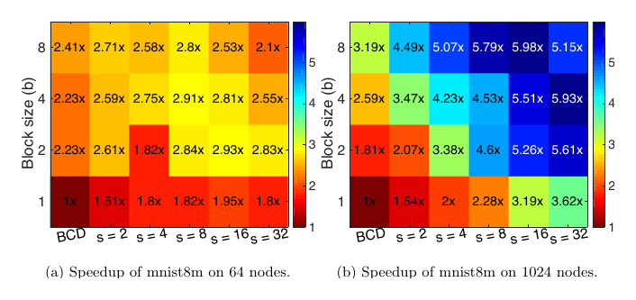

##### Download

+ [Paper](https://doi.org/10.1137/17M1134433)

---

##### Abstract

Primal and dual block coordinate descent methods are iterative methods for solving regularized and unregularized optimization problems. Distributed-memory parallel implementations of these methods have become popular for analyzing large machine learning datasets. However, existing implementations communicate at every iteration which, on modern data center and supercomputing architectures, often dominates the cost of floating-point computation. Recent results on communication-avoiding Krylov subspace methods suggest that large speedups are possible by reorganizing iterative algorithms to avoid communication. We show how similar algorithmic transformations lead to primal and dual block coordinate descent methods that only communicate every $s$ iterations instead of every iteration for the regularized least-squares problem. The communication-avoiding variants reduce the number of synchronizations by a factor of $s$ on distributed-memory parallel machines without altering the convergence rate and attain strong-scaling speedups of up to 6.1x on a Cray XC30 supercomputer.

---

##### Figure 11: CA-BCD Speedup Heatmaps



---

##### Citation

Aditya Devarakonda, Kimon Fountoulakis, James Demmel and Michael W. Mahoney, "Avoiding Communication in Primal and Dual Block Coordinate Descent Methods", *SIAM Journal on Scientific Computing*, 41(1), C1-C27, 2019. https://doi.org/10.1137/17M1134433

```latex
@article{devarakonda2019avoiding,
  title={Avoiding Communication in Primal and Dual Block Coordinate Descent Methods},
  author={Devarakonda, Aditya and Fountoulakis, Kimon and Demmel, James and Mahoney, Michael W.},
  journal={SIAM Journal on Scientific Computing},
  volume={41},
  number={1},
  pages={C1--C27},
  year={2019},
  doi={10.1137/17M1134433},
  url={https://doi.org/10.1137/17M1134433}
}
```

---
