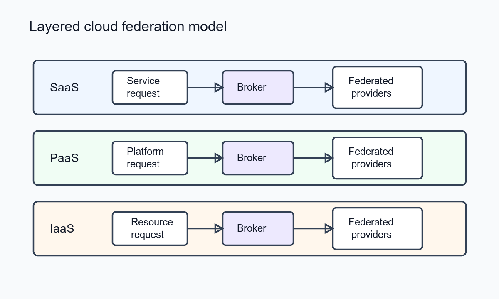

##### Download

+ [Paper](https://doi.org/10.1016/j.jcss.2011.12.017)

---

##### Abstract

We show how a layered Cloud service model of software as a service, platform as a service, and infrastructure as a service leverages multiple independent Clouds by creating a federation among the providers. The layered architecture leads naturally to a design in which inter-Cloud federation takes place at each service layer, mediated by a broker specific to the concerns of the parties at that layer. Federation increases consumer value and facilitates providing IT services as a commodity. This business model for the Cloud is consistent with broker-mediated supply and service delivery chains in other commodity sectors such as finance and manufacturing. Concreteness is added to the federated Cloud model by considering how it works in delivering the Weather Research and Forecasting service as software as a service using platform and infrastructure support. The Weather Research and Forecasting service illustrates delegation and federation, the translation of service requirements between service layers, and inter-Cloud broker functions needed to achieve federation.

---

##### Overview: Layered Cloud Federation Model



---

##### Citation

David Villegas, Norman Bobroff, Ivan Rodero, Javier Delgado, Yanbin Liu, Aditya Devarakonda, Liana Fong, S. Masoud Sadjadi and Manish Parashar, "Cloud Federation in a Layered Service Model", *Journal of Computer and System Sciences*, 78(5), pp. 1330-1344, 2012. https://doi.org/10.1016/j.jcss.2011.12.017

```latex
@article{villegas2012cloud,
  title={Cloud Federation in a Layered Service Model},
  author={Villegas, David and Bobroff, Norman and Rodero, Ivan and Delgado, Javier and Liu, Yanbin and Devarakonda, Aditya and Fong, Liana and Sadjadi, S. Masoud and Parashar, Manish},
  journal={Journal of Computer and System Sciences},
  volume={78},
  number={5},
  pages={1330--1344},
  year={2012},
  doi={10.1016/j.jcss.2011.12.017},
  url={https://doi.org/10.1016/j.jcss.2011.12.017}
}
```

---
