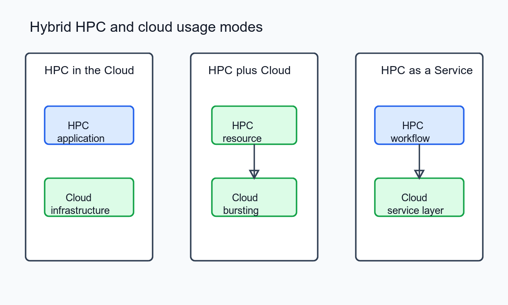

##### Download

+ [Paper](https://doi.org/10.1109/MCSE.2013.49)

---

##### Abstract

Clouds are rapidly joining high-performance computing systems, clusters, and grids as viable platforms for scientific exploration and discovery. As a result, understanding application formulations and usage modes that are meaningful in such a hybrid infrastructure, and how application workflows can effectively utilize it, is critical. Here, three hybrid HPC, grid, and cloud cyberinfrastructure usage modes are explored: HPC in the Cloud, HPC plus Cloud, and HPC as a Service. The article presents illustrative scenarios in each case and outlines benefits, limitations, and research challenges.

---

##### Overview: Hybrid HPC and Cloud Usage Modes



---

##### Citation

Manish Parashar, Moustafa AbdelBaky, Ivan Rodero and Aditya Devarakonda, "Cloud Paradigms and Practices for Computational and Data-Enabled Science and Engineering", *Computing in Science & Engineering*, 15(4), pp. 10-18, 2013. https://doi.org/10.1109/MCSE.2013.49

```latex
@article{parashar2013cloud,
  title={Cloud Paradigms and Practices for Computational and Data-Enabled Science and Engineering},
  author={Parashar, Manish and AbdelBaky, Moustafa and Rodero, Ivan and Devarakonda, Aditya},
  journal={Computing in Science \& Engineering},
  volume={15},
  number={4},
  pages={10--18},
  year={2013},
  doi={10.1109/MCSE.2013.49},
  url={https://doi.org/10.1109/MCSE.2013.49}
}
```

---
