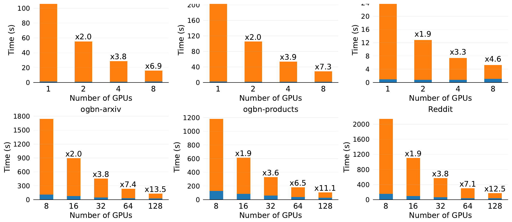

##### Download

+ [Paper](https://arxiv.org/abs/2506.22668)

---

##### Abstract

With the growing adoption of graph neural networks (GNNs), explaining their predictions has become increasingly important. However, attributing predictions to specific edges or features remains computationally expensive. For example, classifying a node with 100 neighbors using a 3-layer GNN may involve identifying important edges from millions of candidates contributing to the prediction. To address this challenge, we propose DistShap, a parallel algorithm that distributes Shapley value-based explanations across multiple GPUs. DistShap operates by sampling subgraphs in a distributed setting, executing GNN inference in parallel across GPUs, and solving a distributed least squares problem to compute edge importance scores. DistShap outperforms most existing GNN explanation methods in accuracy and is the first to scale to GNN models with millions of features by using up to 128 GPUs on the NERSC Perlmutter supercomputer.

---

##### Figure 9: Scalability of DistShap across GPUs



---

##### Citation

Selahattin Akkas, Aditya Devarakonda and Ariful Azad, "DistShap: Scalable GNN Explanations with Distributed Shapley Values", *arXiv:2506.22668*, 2025. https://arxiv.org/abs/2506.22668

```latex
@misc{akkas2025distshap,
      title={DistShap: Scalable GNN Explanations with Distributed Shapley Values},
      author={Selahattin Akkas and Aditya Devarakonda and Ariful Azad},
      year={2025},
      eprint={2506.22668},
      archivePrefix={arXiv},
      primaryClass={cs.LG},
      url={https://arxiv.org/abs/2506.22668},
}
```

---
