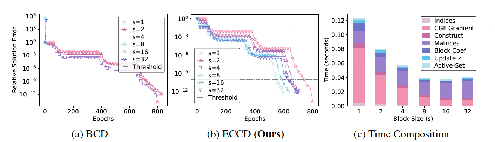

##### Download

+ [Paper](eccd.pdf)
+ [Code and data](https://github.com/Yixiao-Wang-Stats/ECCD)

---

##### Abstract

We present a novel enhanced cyclic coordinate descent (ECCD) framework for solving generalized linear models with elastic net constraints that reduces training time in comparison to existing state-of-the-art methods. We redesign the CD method by performing a Taylor expansion around the current iterate to avoid nonlinear operations arising in the gradient computation. By introducing this approximation we are able to unroll the vector recurrences occurring in the CD method and reformulate the resulting computations into more efficient batched computations. We show empirically that the recurrence can be unrolled by a tunable integer parameter, s, such that s > 1 yields performance improvements without affecting convergence, whereas s = 1 yields the original CD method. A key advantage of ECCD is that it avoids the convergence delay and numerical instability exhibited by block coordinate descent. Finally, we implement our proposed method in C++ using Eigen to accelerate linear algebra computations. Comparison of our method against existing state-of-the-art solvers show consistent performance improvements of 3× in average for regularization path variant on diverse benchmark datasets.

---

##### Figure 2: Results on Duke dataset


---

##### Citation
Yixiao Wang, Zishan Shao, Ting Jiang and Aditya Devarakonda. 2025. "Enhanced Cyclic Coordinate Descent Methods for Elastic Net Penalized Linear Models", *arXiv:2510.19999*, https://arxiv.org/abs/2510.19999 *(Accepted, NeurIPS'25).*

```latex
@misc{wang2025enhancedcycliccoordinatedescent,
      title={Enhanced Cyclic Coordinate Descent Methods for Elastic Net Penalized Linear Models},
      author={Yixiao Wang and Zishan Shao and Ting Jiang and Aditya Devarakonda},
      year={2025},
      eprint={2510.19999},
      archivePrefix={arXiv},
      primaryClass={stat.ML},
      url={https://arxiv.org/abs/2510.19999},
}
```

---
