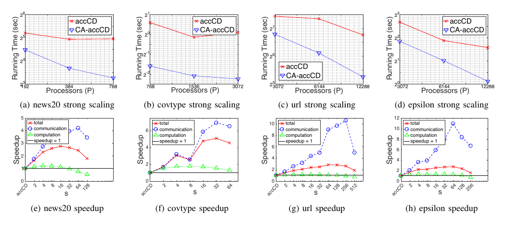

##### Download

+ [Paper](https://doi.org/10.1109/IPDPS.2018.00051)

---

##### Abstract

Parallel computing has played an important role in speeding up convex optimization methods for big data analytics and large-scale machine learning. However, the scalability of these optimization methods is inhibited by the cost of communicating and synchronizing processors in a parallel setting. Iterative machine learning methods are particularly sensitive to communication cost since they often require communication every iteration. In this work, we extend techniques from communication-avoiding Krylov subspace methods to first-order block coordinate descent methods for support vector machines and proximal least-squares problems. Our synchronization-avoiding variants reduce latency cost by a tunable factor of $s$ at the expense of a factor of $s$ increase in flops and bandwidth costs. We show that the synchronization-avoiding variants are numerically stable and can attain speedups of up to 5.1x on a Cray XC30 supercomputer.

---

##### Figure 4: Strong Scaling and Speedups for SA-accCD



---

##### Citation

Aditya Devarakonda, Kimon Fountoulakis, James Demmel and Michael W. Mahoney, "Avoiding Synchronization in First-Order Methods for Sparse Convex Optimization", *2018 IEEE International Parallel and Distributed Processing Symposium (IPDPS)*, pp. 409-418, 2018. https://doi.org/10.1109/IPDPS.2018.00051

```latex
@inproceedings{devarakonda2018avoiding,
  title={Avoiding Synchronization in First-Order Methods for Sparse Convex Optimization},
  author={Devarakonda, Aditya and Fountoulakis, Kimon and Demmel, James and Mahoney, Michael W.},
  booktitle={2018 IEEE International Parallel and Distributed Processing Symposium (IPDPS)},
  pages={409--418},
  year={2018},
  doi={10.1109/IPDPS.2018.00051},
  url={https://doi.org/10.1109/IPDPS.2018.00051}
}
```

---
