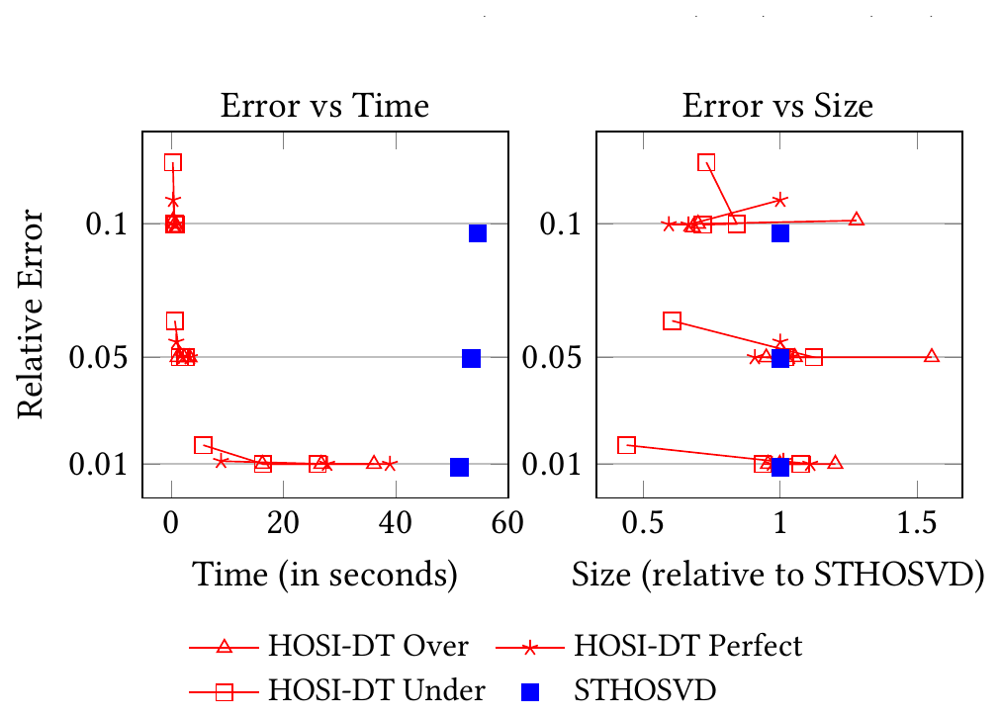

##### Download

+ [Paper](https://doi.org/10.1145/3712285.3759865)

---

##### Abstract

Higher Order Orthogonal Iteration (HOOI) is an iterative algorithm that computes a Tucker decomposition of fixed ranks for an input tensor. Selecting the appropriate ranks in advance is difficult: ranks that are too small sacrifice accuracy, while ranks that are too large waste computation and memory. In this work, we present distributed-memory parallel, rank-adaptive variants of HOOI that determine the core tensor ranks during the computation rather than requiring them as fixed inputs. Our approach formulates an error-specified HOOI that grows the factor matrices to meet a user-prescribed accuracy, and relies on communication-efficient parallel kernels for the dominant tensor-times-matrix (TTM) and SVD operations. We show that the rank-adaptive formulation enables HOOI to scale to large tensors on distributed-memory systems while producing Tucker approximations with competitive accuracy and compression.

---

##### Figure 4: Rank-adaptive HOSI-DT — relative error vs. time and size



---

##### Citation

João Pinheiro, Aditya Devarakonda and Grey Ballard, "Parallel Rank-Adaptive Higher Order Orthogonal Iteration", *Proceedings of the International Conference for High Performance Computing, Networking, Storage and Analysis (SC'25)*, pp. 1800-1815, 2025. https://doi.org/10.1145/3712285.3759865

```latex
@inproceedings{pinheiro2025parallel,
      title={Parallel Rank-Adaptive Higher Order Orthogonal Iteration},
      author={Pinheiro, Jo\~{a}o and Devarakonda, Aditya and Ballard, Grey},
      booktitle={Proceedings of the International Conference for High Performance Computing, Networking, Storage and Analysis (SC'25)},
      pages={1800--1815},
      year={2025},
      doi={10.1145/3712285.3759865},
}
```

---
