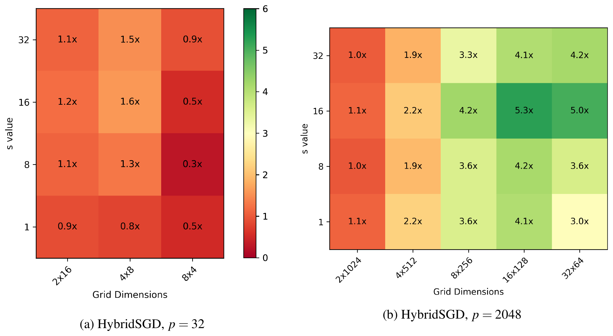

##### Download

+ [Paper](https://arxiv.org/abs/2501.07526)

---

##### Abstract

Distributed-memory implementations of numerical optimization algorithms, such as stochastic gradient descent (SGD), require interprocessor communication at every iteration of the algorithm. On modern distributed-memory clusters where communication is more expensive than computation, the scalability and performance of these algorithms are limited by communication cost. This work generalizes prior work on 1D s-step SGD and 1D Federated SGD with Averaging (FedAvg) to yield a 2D parallel SGD method (HybridSGD) which attains a continuous performance trade-off between the two baseline algorithms. We present theoretical analysis which shows the convergence, computation, communication, and memory trade-offs between s-step SGD, FedAvg, 2D parallel SGD, and other parallel SGD variants. We implement all algorithms in C++ and MPI and evaluate their performance on a Cray EX supercomputing system. Our empirical results show that HybridSGD achieves better convergence than FedAvg at similar processor scales while attaining speedups of 5.3x over s-step SGD and speedups up to 121x over FedAvg when used to solve binary classification tasks using the convex, logistic regression model on datasets obtained from the LIBSVM repository.

---

##### Figure 9: HybridSGD speedup heatmaps over s-step SGD



---

##### Citation

Aditya Devarakonda and Ramakrishnan Kannan, "Communication-Efficient, 2D Parallel Stochastic Gradient Descent for Distributed-Memory Optimization", *arXiv:2501.07526*, 2025. https://arxiv.org/abs/2501.07526

```latex
@misc{devarakonda2025communicationefficient,
      title={Communication-Efficient, 2D Parallel Stochastic Gradient Descent for Distributed-Memory Optimization},
      author={Aditya Devarakonda and Ramakrishnan Kannan},
      year={2025},
      eprint={2501.07526},
      archivePrefix={arXiv},
      primaryClass={cs.DC},
      url={https://arxiv.org/abs/2501.07526},
}
```

---
