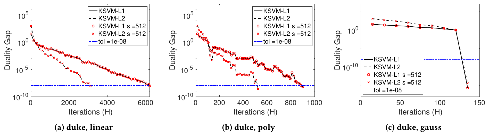

<div style="margin: 1rem 0; padding: 1rem 1.25rem; border-radius: 10px; border: 2px solid #d4af37; background: linear-gradient(135deg, rgba(212,175,55,0.18), rgba(212,175,55,0.06)); font-size: 1.05rem; text-align: center;">
🏆 &nbsp;<strong>Outstanding Paper Award</strong> &nbsp;—&nbsp; HPC Asia 2025
</div>

##### Download

+ [Paper](https://arxiv.org/abs/2406.18001)

---

##### Abstract

Dual Coordinate Descent (DCD) and Block Dual Coordinate Descent (BDCD) are important iterative methods for solving convex optimization problems. In this work, we develop scalable DCD and BDCD methods for the kernel support vector machines (K-SVM) and kernel ridge regression (K-RR) problems. On distributed-memory parallel machines the scalability of these methods is limited by the need to communicate every iteration. On modern hardware where communication is orders of magnitude more expensive, the running time of the DCD and BDCD methods is dominated by communication cost. We address this communication bottleneck by deriving s-step variants of DCD and BDCD for solving the K-SVM and K-RR problems, respectively. The s-step variants reduce the frequency of communication by a tunable factor of s at the expense of additional bandwidth and computation. The s-step variants compute the same solution as the existing methods in exact arithmetic. We perform numerical experiments to illustrate that the s-step variants are also numerically stable in finite-arithmetic, even for large values of s. We perform theoretical analysis to bound the computation and communication costs of the newly designed variants, up to leading order. Finally, we develop high performance implementations written in C and MPI and present scaling experiments performed on a Cray EX cluster. The new s-step variants achieved strong scaling speedups of up to 9.8x over existing methods using up to 512 cores.

---

##### Figure 1: Convergence of DCD vs. s-step DCD (K-SVM-L1/L2)



---

##### Citation

Zishan Shao and Aditya Devarakonda, "Scalable Dual Coordinate Descent for Kernel Methods", *Proceedings of the International Conference on High Performance Computing in Asia-Pacific Region (HPC-Asia'25)*, pp. 52-63, 2025. **Outstanding Paper Award.** https://doi.org/10.1145/3712031.3712034

```latex
@inproceedings{shao2025scalable,
      title={Scalable Dual Coordinate Descent for Kernel Methods},
      author={Shao, Zishan and Devarakonda, Aditya},
      booktitle={Proceedings of the International Conference on High Performance Computing in Asia-Pacific Region (HPC-Asia'25)},
      pages={52--63},
      year={2025},
      doi={10.1145/3712031.3712034},
}
```

---
