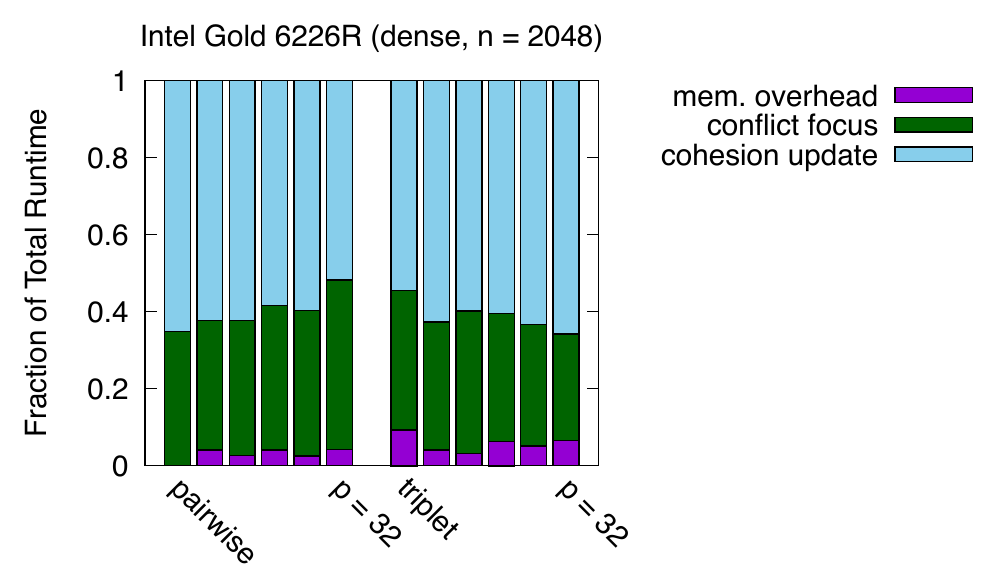

##### Download

+ [Paper](https://doi.org/10.1137/1.9781611977967.5)

---

##### Abstract

In this work, we design, analyze, and optimize sequential and shared-memory parallel algorithms for partitioned local depths (PaLD). Given a set of data points and pairwise distances, PaLD identifies the strength of pairwise relationships based on relative distances, enabling the identification of strong ties within dense and sparse communities even when their sizes and within-community absolute distances vary greatly. We design two algorithmic variants that perform community structure analysis through triplet comparisons of pairwise distances. We present theoretical analyses of computation and communication costs and prove that the sequential algorithms are communication optimal, up to constant factors. We introduce performance optimization strategies that yield sequential speedups of up to 29x over a baseline sequential implementation and parallel speedups of up to 19.4x over optimized sequential implementations using up to 32 threads on an Intel multicore CPU.

---

##### Runtime Breakdown for Optimized PaLD Kernels



---

##### Citation

Aditya Devarakonda and Grey Ballard, "Sequential and Shared-Memory Parallel Algorithms for Partitioned Local Depths", *Proceedings of the 2024 SIAM Conference on Parallel Processing for Scientific Computing*, pp. 53-64, 2024. https://doi.org/10.1137/1.9781611977967.5

```latex
@inproceedings{devarakonda2024sequential,
  title={Sequential and Shared-Memory Parallel Algorithms for Partitioned Local Depths},
  author={Devarakonda, Aditya and Ballard, Grey},
  booktitle={Proceedings of the 2024 SIAM Conference on Parallel Processing for Scientific Computing},
  pages={53--64},
  year={2024},
  doi={10.1137/1.9781611977967.5},
  url={https://doi.org/10.1137/1.9781611977967.5}
}
```

---
