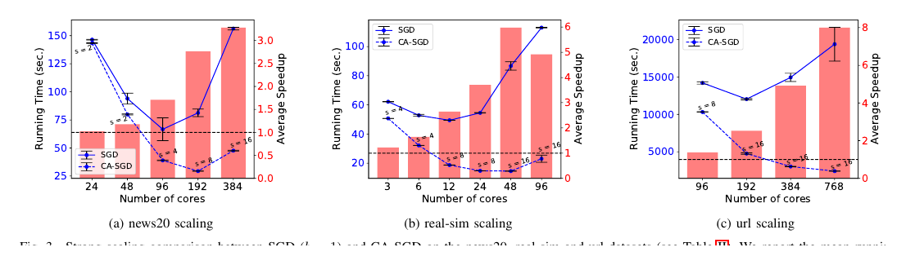

##### Download

+ [Paper](https://doi.org/10.1109/HiPC50609.2020.00023)

---

##### Abstract

Stochastic gradient descent (SGD) is one of the most widely used optimization methods for solving machine learning problems. SGD solves an optimization problem by iteratively sampling a few data points from the input data, computing gradients for the selected data points, and updating the solution. However, in a parallel setting, SGD requires interprocess communication at every iteration. We introduce a communication-avoiding technique for solving logistic regression using SGD. This technique reorganizes the SGD computations into a form that communicates every $s$ iterations instead of every iteration, where $s$ is a tuning parameter. We prove theoretical flops, bandwidth, and latency upper bounds for SGD and its communication-avoiding variant. Experimental results show that Communication-Avoiding SGD (CA-SGD) achieves speedups of up to 4.97x on a high-performance InfiniBand cluster without altering the convergence behavior or accuracy.

---

##### Figure 3: Strong Scaling of SGD and CA-SGD



---

##### Citation

Aditya Devarakonda and James Demmel, "Avoiding Communication in Logistic Regression", *2020 IEEE 27th International Conference on High Performance Computing, Data, and Analytics (HiPC)*, pp. 91-100, 2020. https://doi.org/10.1109/HiPC50609.2020.00023

```latex
@inproceedings{devarakonda2020avoiding,
  title={Avoiding Communication in Logistic Regression},
  author={Devarakonda, Aditya and Demmel, James},
  booktitle={2020 IEEE 27th International Conference on High Performance Computing, Data, and Analytics (HiPC)},
  pages={91--100},
  year={2020},
  doi={10.1109/HiPC50609.2020.00023},
  url={https://doi.org/10.1109/HiPC50609.2020.00023}
}
```

---
