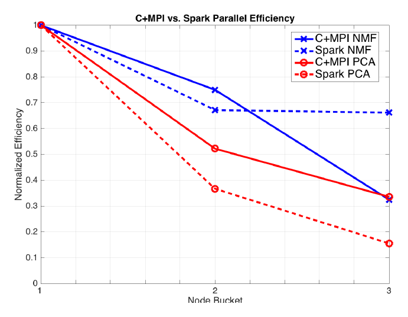

##### Download

+ [Paper](https://doi.org/10.1109/BigData.2016.7840606)

---

##### Abstract

We explore the trade-offs of performing linear algebra using Apache Spark compared to traditional C and MPI implementations on high-performance computing platforms. Spark is designed for data analytics on cluster computing platforms with access to local disks and is optimized for data-parallel tasks. We examine three widely used matrix factorizations: NMF for physical plausibility, PCA for ubiquity, and CX for data interpretability. We apply these methods to 1.6 TB particle physics, 2.2 TB and 16 TB climate modeling, and 1.1 TB bioimaging data. The data matrices are tall and skinny, which enables the algorithms to map conveniently into Spark's data-parallel model. We perform scaling experiments on up to 1600 Cray XC40 nodes, describe the sources of slowdowns, and provide tuning guidance to obtain high performance.

---

##### Figure 4: C+MPI and Spark Parallel Efficiency



---

##### Citation

Alex Gittens, Aditya Devarakonda, Evan Racah, Michael Ringenburg, Lisa Gerhardt, Jey Kottalam, Jialin Liu, Kristyn Maschhoff, Shane Canon, Jatin Chhugani, Pramod Sharma, Jianlin Yang, James Demmel, Jim Harrell, Vijay Krishnamurthy, Michael W. Mahoney and Prabhat, "Matrix Factorizations at Scale: A Comparison of Scientific Data Analytics in Spark and C+MPI Using Three Case Studies", *2016 IEEE International Conference on Big Data*, pp. 204-213, 2016. https://doi.org/10.1109/BigData.2016.7840606

```latex
@inproceedings{gittens2016matrix,
  title={Matrix Factorizations at Scale: A Comparison of Scientific Data Analytics in Spark and C+MPI Using Three Case Studies},
  author={Gittens, Alex and Devarakonda, Aditya and Racah, Evan and Ringenburg, Michael and Gerhardt, Lisa and Kottalam, Jey and Liu, Jialin and Maschhoff, Kristyn and Canon, Shane and Chhugani, Jatin and Sharma, Pramod and Yang, Jianlin and Demmel, James and Harrell, Jim and Krishnamurthy, Vijay and Mahoney, Michael W. and Prabhat},
  booktitle={2016 IEEE International Conference on Big Data},
  pages={204--213},
  year={2016},
  doi={10.1109/BigData.2016.7840606},
  url={https://doi.org/10.1109/BigData.2016.7840606}
}
```

---
