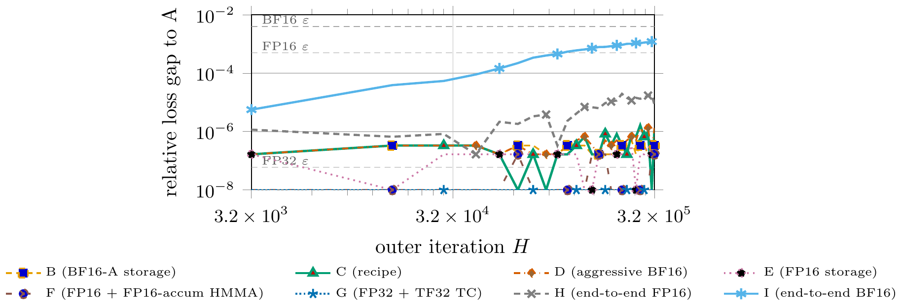

##### Download

+ [Paper](https://arxiv.org/abs/2606.18463)

---

##### Abstract

Distributed stochastic gradient descent (SGD) is limited by communication rather than computation, since each iteration requires an AllReduce across processes. Communication-avoiding SGD (CA-SGD) amortizes communication over s iterations by replacing s consecutive AllReduces with a single AllReduce of an sb×sb Gram matrix, trading more computation and bandwidth for fewer synchronization points. Modern GPUs with matrix hardware and reduced-precision formats offset this by accelerating the Gram GEMM and shrinking BF16 traffic. We study mixed-precision CA-SGD for generalized linear models on NVIDIA GPUs. Our finite-precision analysis decomposes the local rounding error of one CA-SGD outer iteration into nine independent precision choices, depending on the hardware only through its low-precision unit roundoffs, so the resulting recipes transfer in principle across GPU generations. The recipe stores the input matrix and margin vector in low precision, computes the Gram matrix from low-precision inputs with high-precision accumulation, communicates it in high precision, and performs the inner recurrence and weight updates in high precision. On NERSC Perlmutter A100 GPUs, mixed-precision CA-SGD matches FP32 SGD loss within 0.5% on logistic, linear, and Poisson problems and reaches 5.1--6.8× speedup over FP32 SGD on epsilon, SUSY, HIGGS, synth, and Poisson-synth.

---

##### Figure 3: Relative loss gap to the FP32 reference recipe



---

##### Citation

Aditya Devarakonda, Irene Simó Muñoz and Giulia Guidi, "Mixed-Precision Communication-Avoiding SGD for Generalized Linear Models on GPUs", *arXiv:2606.18463*, 2026. https://arxiv.org/abs/2606.18463

```latex
@misc{devarakonda2026mixedprecision,
      title={Mixed-Precision Communication-Avoiding SGD for Generalized Linear Models on GPUs},
      author={Aditya Devarakonda and Irene Sim\'{o} Mu\~{n}oz and Giulia Guidi},
      year={2026},
      eprint={2606.18463},
      archivePrefix={arXiv},
      primaryClass={cs.DC},
      url={https://arxiv.org/abs/2606.18463},
}
```

---
