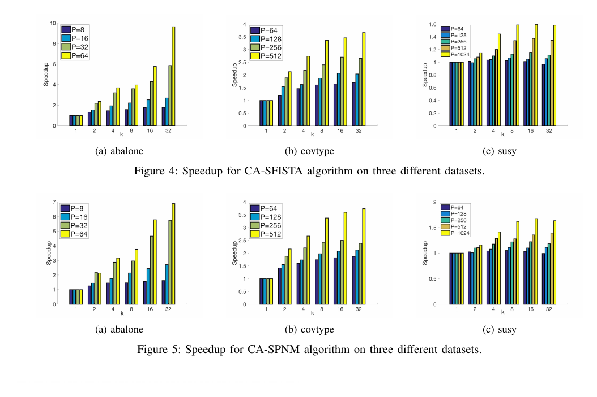

##### Download

+ [Paper](https://arxiv.org/abs/1710.08883)

---

##### Abstract

Proximal methods are iterative algorithms for solving nonsmooth convex optimization problems, including $\ell_1$-regularized least-squares problems. Distributed-memory implementations of these methods enable the analysis of large-scale machine learning problems, but their scalability is limited by communication overhead on modern distributed architectures. This technical report studies communication-avoiding proximal variants that use iteration overlap and Hessian reuse to reduce latency costs while preserving the bandwidth profile of the baseline methods. The resulting algorithms are evaluated in distributed-memory settings and motivate the proceedings version on communication-reducing proximal Newton methods for sparse least-squares problems.

---

##### Figures 4 and 5: CA-SFISTA and CA-SPNM Speedups



---

##### Citation

Saeed Soori, Aditya Devarakonda, Zachary Blanco, James Demmel, Mert Gurbuzbalaban and Maryam Mehri Dehnavi, "Avoiding Communication in Proximal Methods for Convex Optimization Problems", *arXiv:1710.08883*, 2017. https://arxiv.org/abs/1710.08883

```latex
@misc{soori2017avoiding,
  title={Avoiding Communication in Proximal Methods for Convex Optimization Problems},
  author={Soori, Saeed and Devarakonda, Aditya and Blanco, Zachary and Demmel, James and Gurbuzbalaban, Mert and Dehnavi, Maryam Mehri},
  year={2017},
  eprint={1710.08883},
  archivePrefix={arXiv},
  primaryClass={cs.DC},
  url={https://arxiv.org/abs/1710.08883}
}
```

---
