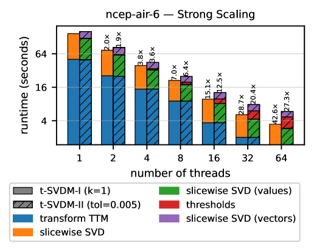

##### Download

+ [Paper](https://arxiv.org/abs/2605.16058)

---

##### Abstract

In the era of big data, effectively compressing large datasets while performing complex mathematical operations is crucial. Tensor-based decomposition methods have shown superior compression capabilities with minimal loss of accuracy compared to traditional matrix methods. Under the star-M tensor framework, tensors can be decomposed in a matrix-mimetic way, including using the star-M SVD. This tensor SVD has optimality guarantees and has shown exceptional performance on specific types of data, but software implementations have been mostly limited to productivity-oriented languages. In this work, we present our development of a shared-memory parallel, high-performance solution designed to efficiently implement the underlying algorithms. This software will enable optimal compression of extensive scientific datasets, paving the way for enhanced data analysis and insights.

---

##### Figure 6: Strong scaling of the star-M SVD on the ncep-air-6 dataset



---

##### Citation

Md Taufique Hussain, Grey Ballard, Aditya Devarakonda, Srinivas Eswar, Naman Pesricha and Vishwas Rao, "High-Performance Star-M SVD for Big Data Compression", *arXiv:2605.16058*, 2026. https://arxiv.org/abs/2605.16058

```latex
@misc{hussain2026highperformance,
      title={High-Performance Star-M SVD for Big Data Compression},
      author={Md Taufique Hussain and Grey Ballard and Aditya Devarakonda and Srinivas Eswar and Naman Pesricha and Vishwas Rao},
      year={2026},
      eprint={2605.16058},
      archivePrefix={arXiv},
      primaryClass={cs.DC},
      url={https://arxiv.org/abs/2605.16058},
}
```

---
